# Trainer Class Skill Trees

Generated: 2026-03-04T02:15:42.687448+00:00

## Ace Trainer

Prerequisites: Novice Command


## Apparition

Prerequisites: Elemental Connection (Ghost), Novice Intimidate, Novice Occult Education

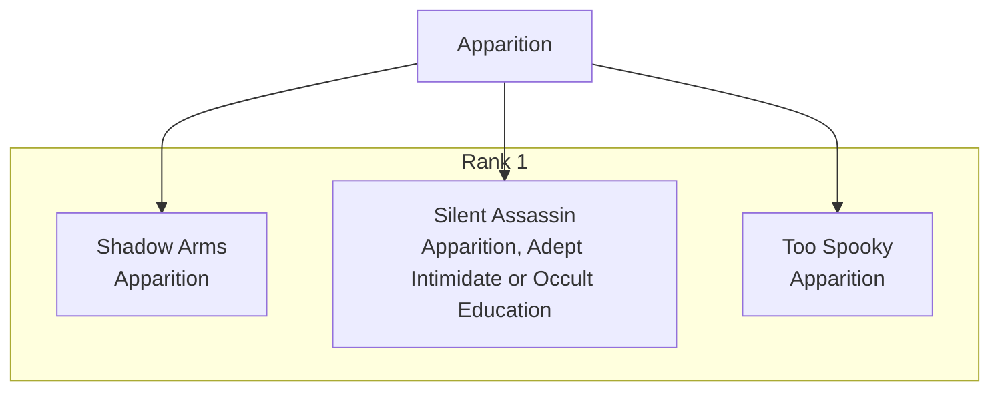

## Arcanist

Prerequisites: Arcane Training

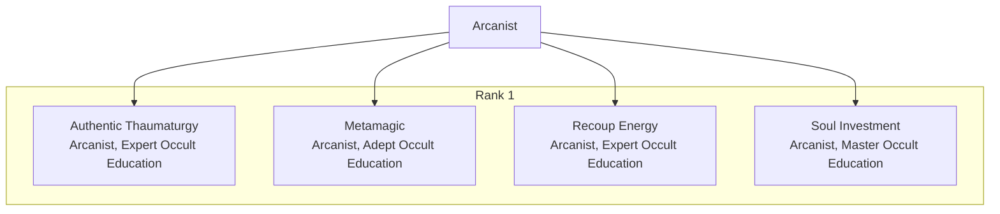

## Athlete

Prerequisites: Novice Athletics, One of Athletic Prowess, Mounted Prowess, Power Boost, Stamina, or Swimmer

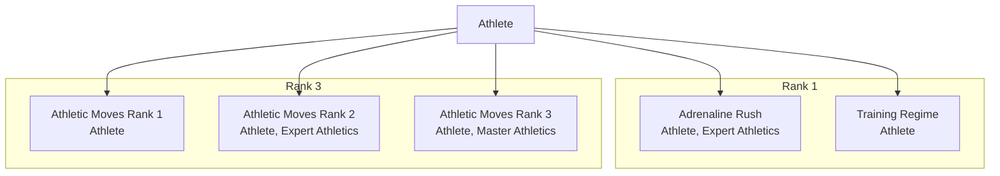

## Attack Ace

Prerequisites: Ace Trainer or Style Expert, 1 Pokémon with Attack of 15 or more, Novice Command or Focus
Or
3 Pokémon with Attack at 20 or higher, Novice Command or Focus


## Backpacker

Prerequisites: Traveler

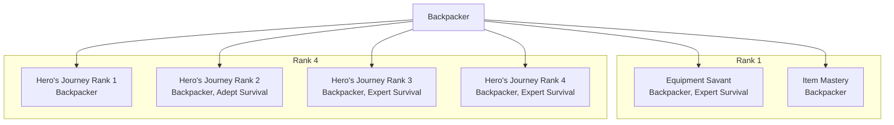

## Berserker

Prerequisites: Novice Combat, Novice Intimidate

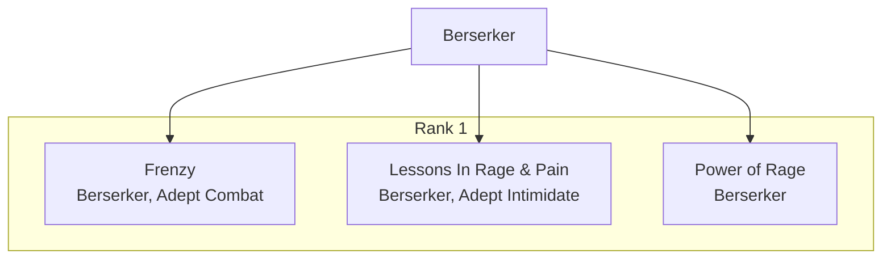

## Capture Specialist

Prerequisites: Acrobatics, Athletics, Stealth, or Survival at Novice; Guile, or Perception at Novice


## Channeler

Prerequisites: Mystic Senses

Mechanics:
- Channeling: While Channeling a Pokémon, it may communicate its intentions, emotions, and motivations to you and you may communicate similarly with them; neither party may be deceitful in this exchange. You also become aware of all of its Moves, Abilities, and Capabilities. Allied Channeled Pokémon may always attempt Intercept Maneuvers for each other, regardless of Loyalty. If you are Fainted, you stop Channeling all Pokémon. Whenever you Channel a Pokémon, you have a vague knowledge of what has happened in the Pokémon’s past hour as if they were your own memories.

Note: Channeler has a couple Features with the [Orders] tag. However, because they require that a Pokémon be Channeled, which isn’t League Legal, they actually aren’t of any use in League Legal battles!
- Recipes: 

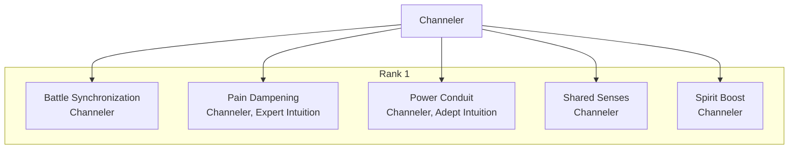

## Cheerleader

Prerequisites: Inspired Training, Novice Charm

Mechanics:
- Cheered / Excited / Motivated: »» Cheered – Pokémon or Trainers may give up the Cheered condition when making a Save Check to roll twice, and take the best result.
»» Excited – Pokémon or Trainers may give up the Excited condition when hit by a Damaging Attack to gain +5 Damage Reduction against that attack.
»» Motivated – Pokémon or Trainers may give up the Motivated condition as a Free Action to increase a Combat Stage that is below its Default Value (usually 0 CS) by +1 CS.

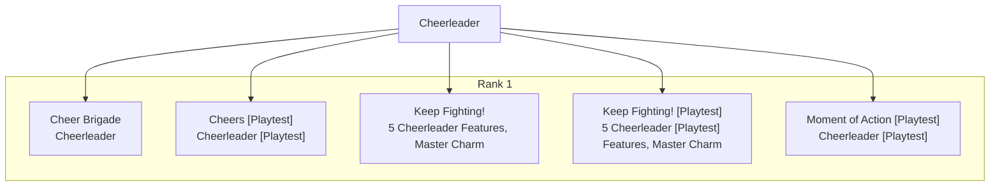

## Cheerleader [Playtest]

Prerequisites: Inspired Training, Novice Charm


## Chef

Prerequisites: Basic Cooking, Novice Intuition

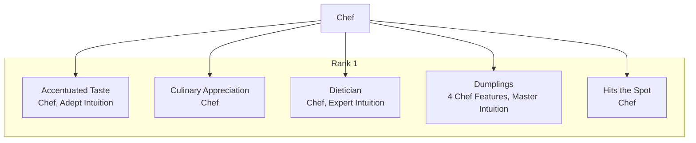

## Chronicler

Prerequisites: Novice Perception

Mechanics:
- Archives: »» Profile Archive: You may place Records of Pokémon and Trainers in your Profile Archive. You gain a +2 bonus to Charm, Guile, Command, Intimidate, and Intuition Checks targeting Pokémon and Trainers in your Profile Archive.
»» Technique Archive: You may place Records of Moves in your Technique Archive. You and your Pokémon gain +2 Evasion against Moves in your Technique Archives.
»» Travel Archive: You may place Records of Locations in your Travel Archive. When you gain Travel Archive, choose Keen Eye or Perception. While you are in a Location in your Travel Archive, you have the Chosen Ability and gain a +2 bonus to Perception Checks to notice the environment.

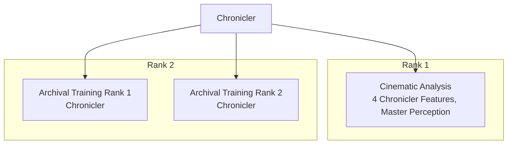

## Commander

Prerequisites: Novice Command

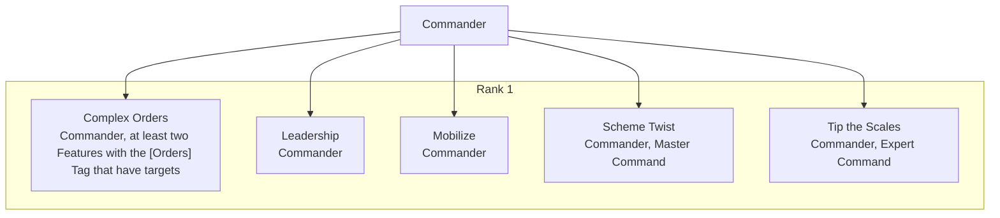

## Coordinator

Prerequisites: Grace, Novice Charm, Command, Guile, Intimidate, or Intuition

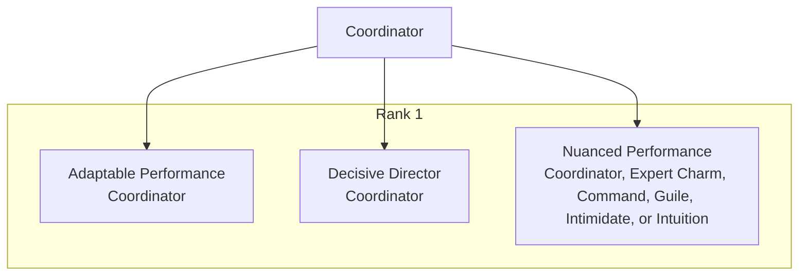

## Dancer

Prerequisites: Novice Acrobatics; Novice Athletics or Charm

Mechanics:
- Dance Moves: Dance Moves you create with the Dance Form Feature look like the Move below. First, name the Dance Move whatever you like. Secondly, choose two Combat Stage gains for the effect. This may either be +2 Combat Stages to a single Stat, like Swords Dance, or +1 Combat Stage to two different Stats, like Dragon Dance. Once chosen, this cannot be changed. Dragon Dance, Quiver Dance, and Swords Dance count as Dance Moves for the purposes of Dancer Features as well. A Dance Move’s Contest Type must be chosen from a Contest Type associated with a Stat that the Dance Move affects. Cool is associated with Attack, Tough is associated with Defense, Beauty is associated with Special Attack, Smart is associated with Special Defense, and Cute is associated with Speed.

Name
Type: Normal
Frequency: EOT
AC: None
Class: Status
Range: Self
Effect:
Contest Type:
Contest Effect: Get Ready!

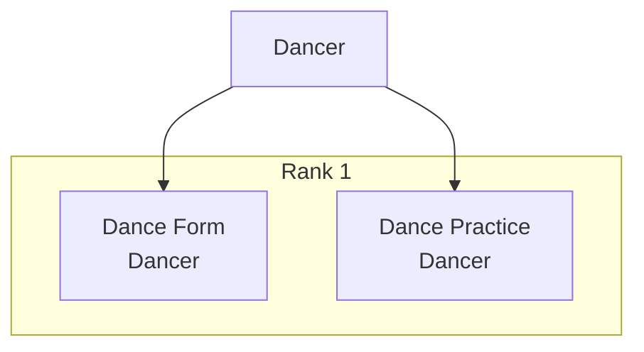

## Defense Ace

Prerequisites: Ace Trainer or Style Expert, 1 Pokémon with Defense of 15 or more, Novice Command or Focus
Or
3 Pokémon with Defense at 20 or higher, Novice Command or Focus


## Druid

Prerequisites: Elemental Connection (Grass), Novice Survival, Novice General Education

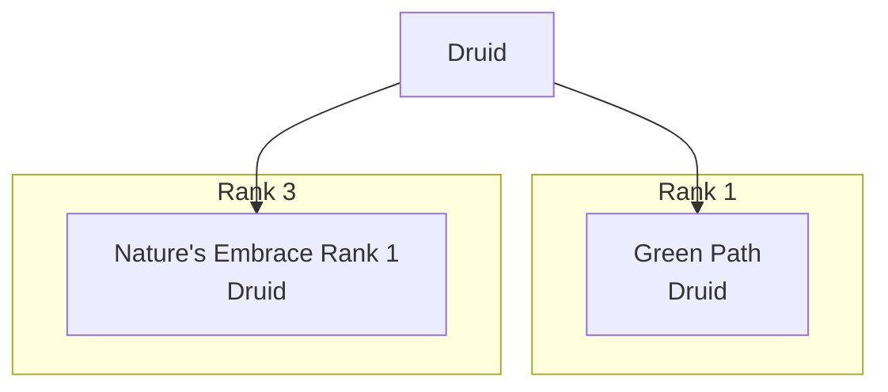

## Duelist

Prerequisites: Focused Training, Novice Focus

Mechanics:
- Momentum: »» Your Pokémon begins each Scene with 0 Momentum.
»» At the end of each Combat round, your Pokémon gains +1 Momentum.
»» Whenever your Pokémon hits a Tagged foe, they gain +1 Momentum.
»» Your Pokémon has a maximum of 6 Momentum. So use a d6 to track it.
»» All Momentum is lost when your Pokémon Faints, your Pokémon is recalled, or combat ends.

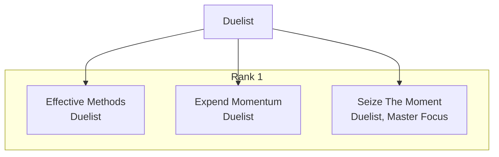

## Earth Shaker

Prerequisites: Elemental Connection (Ground), Novice Intuition, Novice Focus


## Enduring Soul

Prerequisites: Novice Athletics and Focus

```mermaid
flowchart TB
  C_enduring_soul["Enduring Soul"]
```

## Fashionista

Prerequisites: Two of Charm, Command, Guile, Intuition, or Intimidate at Novice

```mermaid
flowchart TB
  C_fashionista["Fashionista"]
  subgraph C_fashionista_R1["Rank 1"]
    C_fashionista_R1_0["Accessorize\nDashing Makeover, one Fashionista Skill at Adept"]
    C_fashionista_R1_1["Dashing Makeover\nFashionista"]
    C_fashionista_R1_2["Dress to Impress\nVersatile Wardrobe, two Fashionista Skills at Expert"]
    C_fashionista_R1_3["Parfumier\nFashionista, one Fashionista Skill at Expert"]
    C_fashionista_R1_4["Style is Eternal\nFashionista"]
    C_fashionista_R1_5["Versatile Wardrobe\nFashionista, two Fashionista Skills at Adept"]
  end
  C_fashionista --> C_fashionista_R1_0
  C_fashionista --> C_fashionista_R1_1
  C_fashionista --> C_fashionista_R1_2
  C_fashionista --> C_fashionista_R1_3
  C_fashionista --> C_fashionista_R1_4
  C_fashionista --> C_fashionista_R1_5
```

## Fire Bringer

Prerequisites: Elemental Connection (Fire), Novice Combat

```mermaid
flowchart TB
  C_fire_bringer["Fire Bringer"]
```

## Fortress

Prerequisites: Novice Combat, Novice Focus

```mermaid
flowchart TB
  C_fortress["Fortress"]
  subgraph C_fortress_R1["Rank 1"]
    C_fortress_R1_0["Guardian's Punishment\nFortress, Expert Combat or Focus"]
    C_fortress_R1_1["Slow or Steady\nFortress"]
    C_fortress_R1_2["Stalwart Bastion\nFortress"]
    C_fortress_R1_3["Wall of Iron\nFortress, Adept Combat or Focus"]
  end
  C_fortress --> C_fortress_R1_0
  C_fortress --> C_fortress_R1_1
  C_fortress --> C_fortress_R1_2
  C_fortress --> C_fortress_R1_3
```

## Frost Touched

Prerequisites: Elemental Connection (Ice), Novice Athletics, Novice Survival

```mermaid
flowchart TB
  C_frost_touched["Frost Touched"]
```

## Glamour Weaver

Prerequisites: Elemental Connection (Fairy), Novice Charm, Novice Occult Education

```mermaid
flowchart TB
  C_glamour_weaver["Glamour Weaver"]
```

## Glitch Bender

Prerequisites: Glitched Existence, Novice Focus, Occult Education, or Perception

```mermaid
flowchart TB
  C_glitch_bender["Glitch Bender"]
```

## Herald of Pride

Prerequisites: Elemental Connection (Dragon), Novice Command, Novice Intimidate

```mermaid
flowchart TB
  C_herald_of_pride["Herald of Pride"]
```

## Hex Maniac

Prerequisites: Novice Occult Education

```mermaid
flowchart TB
  C_hex_maniac["Hex Maniac"]
```

## Hobbyist

Prerequisites: Novice General Education, Novice Perception

```mermaid
flowchart TB
  C_hobbyist["Hobbyist"]
  subgraph C_hobbyist_R1["Rank 1"]
    C_hobbyist_R1_0["Dabbler\nHobbyist, Expert General Education or Perception"]
    C_hobbyist_R1_1["Look and Learn\nHobbyist, Expert General Education or Perception"]
  end
  subgraph C_hobbyist_R4["Rank 4"]
    C_hobbyist_R4_0["Dilettante Rank 1\nHobbyist"]
    C_hobbyist_R4_1["Dilettante Rank 2\nHobbyist"]
    C_hobbyist_R4_2["Dilettante Rank 3\nHobbyist"]
    C_hobbyist_R4_3["Dilettante Rank 4\nHobbyist"]
  end
  C_hobbyist --> C_hobbyist_R1_0
  C_hobbyist --> C_hobbyist_R1_1
  C_hobbyist --> C_hobbyist_R4_0
  C_hobbyist --> C_hobbyist_R4_1
  C_hobbyist --> C_hobbyist_R4_2
  C_hobbyist --> C_hobbyist_R4_3
```

## Hunter

Prerequisites: Novice Survival, Novice Stealth

```mermaid
flowchart TB
  C_hunter["Hunter"]
  subgraph C_hunter_R1["Rank 1"]
    C_hunter_R1_0["Finisher\nHunter, Adept Stealth, Adept Survival"]
    C_hunter_R1_1["Hunter's Reflexes\nHunter, Adept Stealth or Survival"]
    C_hunter_R1_2["Mental Resistance\nWitch Hunter"]
    C_hunter_R1_3["Pack Tactics\nHunter"]
    C_hunter_R1_4["Psionic Analysis\nWitch Hunter, Master Occult Education"]
    C_hunter_R1_5["Surprise!\nHunter, Adept Stealth or Survival"]
  end
  C_hunter --> C_hunter_R1_0
  C_hunter --> C_hunter_R1_1
  C_hunter --> C_hunter_R1_2
  C_hunter --> C_hunter_R1_3
  C_hunter --> C_hunter_R1_4
  C_hunter --> C_hunter_R1_5
```

## Juggler

Prerequisites: Quick Switch, Novice Acrobatics, Novice Guile

```mermaid
flowchart TB
  C_juggler["Juggler"]
  subgraph C_juggler_R1["Rank 1"]
    C_juggler_R1_0["Bounce Shot\nJuggler"]
    C_juggler_R1_1["Emergency Release\nJuggler, Expert Acrobatics or Guile"]
    C_juggler_R1_2["Juggling Show\nJuggler"]
    C_juggler_R1_3["Round Trip\nJuggler, Adept Acrobatics or Guile"]
  end
  C_juggler --> C_juggler_R1_0
  C_juggler --> C_juggler_R1_1
  C_juggler --> C_juggler_R1_2
  C_juggler --> C_juggler_R1_3
```

## Maelstrom

Prerequisites: Elemental Connection (Water), Novice Athletics, Novice Acrobatics

```mermaid
flowchart TB
  C_maelstrom["Maelstrom"]
  subgraph C_maelstrom_R3["Rank 3"]
    C_maelstrom_R3_0["Call the Current Rank 1\nMaelstrom"]
  end
  C_maelstrom --> C_maelstrom_R3_0
```

## Marksman

Prerequisites: Novice Combat, Novice Perception

```mermaid
flowchart TB
  C_marksman["Marksman"]
  subgraph C_marksman_R1["Rank 1"]
    C_marksman_R1_0["Aiming Down The Sights\nMarksman"]
    C_marksman_R1_1["Clear Shot\nMarksman, Expert Perception or Combat"]
    C_marksman_R1_2["Crippling Shot\nMarksman, Expert Perception or Combat"]
    C_marksman_R1_3["Dead-Eye Shot\nMarksman, Master Combat or Perception"]
    C_marksman_R1_4["Double Shot\nMarksman, Adept Combat"]
    C_marksman_R1_5["Long Shot\nMarksman Orders"]
    C_marksman_R1_6["Overwatch\nMarksman, Adept Perception or Combat"]
    C_marksman_R1_7["Trick Shot\nMarksman Orders"]
  end
  C_marksman --> C_marksman_R1_0
  C_marksman --> C_marksman_R1_1
  C_marksman --> C_marksman_R1_2
  C_marksman --> C_marksman_R1_3
  C_marksman --> C_marksman_R1_4
  C_marksman --> C_marksman_R1_5
  C_marksman --> C_marksman_R1_6
  C_marksman --> C_marksman_R1_7
```

## Martial Artist

Prerequisites: Basic Martial Arts, Novice Combat

```mermaid
flowchart TB
  C_martial_artist["Martial Artist"]
```

## Medic

Prerequisites: Novice Medicine Education

```mermaid
flowchart TB
  C_medic["Medic"]
  subgraph C_medic_R1["Rank 1"]
    C_medic_R1_0["First Aid Expertise\nMedic Training, Expert Medicine Education"]
    C_medic_R1_1["Front Line Healer\nMedic"]
    C_medic_R1_2["Medical Techniques [Medic]\nMedic, Adept Medicine Education"]
  end
  subgraph C_medic_R2["Rank 2"]
    C_medic_R2_0["I'm A Doctor Rank 1\nMedic"]
    C_medic_R2_1["I'm A Doctor Rank 2\nMedic, Adept Medicine Education"]
  end
  C_medic --> C_medic_R1_0
  C_medic --> C_medic_R1_1
  C_medic --> C_medic_R1_2
  C_medic --> C_medic_R2_0
  C_medic --> C_medic_R2_1
```

## Mentor

Prerequisites: Two of Charm, Intimidate, Intuition, or Pokémon Education at Novice Rank

```mermaid
flowchart TB
  C_mentor["Mentor"]
  subgraph C_mentor_R1["Rank 1"]
    C_mentor_R1_0["Expand Horizons\nMentor"]
    C_mentor_R1_1["Guidance\nMentor"]
    C_mentor_R1_2["Lessons\nMentor"]
    C_mentor_R1_3["Lifelong Learning\nMove Tutor, one Mentor Skill at Master Rank"]
    C_mentor_R1_4["Move Tutor\nMentor, one Mentor Skill at Expert Rank"]
  end
  C_mentor --> C_mentor_R1_0
  C_mentor --> C_mentor_R1_1
  C_mentor --> C_mentor_R1_2
  C_mentor --> C_mentor_R1_3
  C_mentor --> C_mentor_R1_4
```

## Miasmic

Prerequisites: Elemental Connection (Poison), Novice Stealth, Novice Guile

```mermaid
flowchart TB
  C_miasmic["Miasmic"]
  subgraph C_miasmic_R1["Rank 1"]
    C_miasmic_R1_0["Corrupt Blood\nMiasmic"]
    C_miasmic_R1_1["Flexible Form\nMiasmic"]
  end
  C_miasmic --> C_miasmic_R1_0
  C_miasmic --> C_miasmic_R1_1
```

## Musician

Prerequisites: Novice Charm, Novice Focus

Mechanics:
- Songs: Musician Songs can be triggered one of four ways. Regardless of the Area of Effect, Songs always affect the user.
»» When using a Move with the Sonic keyword, Songs may be triggered as a Swift Action, and the Song’s Area of Effect is the same as the triggering Move’s.
»» When using a Dance Move, Songs may be triggered as a Shift Action with an Area of Effect of Burst 2.
»» As a Standard Action, you may trigger one Song, with an Area of Effect of Burst 4.
»» As a Full Action, you may trigger two Songs, each with an Area of Effect of Burst 4.

Song of Courage: 1 AP - Special, Trigger: Song
Effect: All Allies in the Area of Effect gain a +2 Bonus to Skill Checks and Save Checks until the end of your next turn.
Song of Life: 1 AP - Special, Trigger: Song
Effect: All Allies in the Area of Effect gain 5 Damage Reduction until the end of your next turn.
Song of Might: 1 AP - Special, Trigger: Song
Effect: All Allies in the Area of Effect gain a +5 Bonus to Damage Rolls until the end of your next turn.

```mermaid
flowchart TB
  C_musician["Musician"]
  subgraph C_musician_R1["Rank 1"]
    C_musician_R1_0["Mt. Moon Blues\nMusician"]
    C_musician_R1_1["Musical Ability\nMusician"]
  end
  C_musician --> C_musician_R1_0
  C_musician --> C_musician_R1_1
```

## Ninja

Prerequisites: Novice Stealth, Novice Combat

```mermaid
flowchart TB
  C_ninja["Ninja"]
  subgraph C_ninja_R1["Rank 1"]
    C_ninja_R1_0["Genjutsu\nNinja, Adept Stealth"]
    C_ninja_R1_1["Ninja's Arsenal\nNinja"]
    C_ninja_R1_2["Poison Weapon\nNinja, Adept Stealth"]
    C_ninja_R1_3["Utility Drop\nNinja's Arsenal, Expert Stealth"]
    C_ninja_R1_4["Weightless Step\nNinja, Expert Stealth"]
  end
  C_ninja --> C_ninja_R1_0
  C_ninja --> C_ninja_R1_1
  C_ninja --> C_ninja_R1_2
  C_ninja --> C_ninja_R1_3
  C_ninja --> C_ninja_R1_4
```

## Oracle

Prerequisites: Mystic Senses, Novice Perception

```mermaid
flowchart TB
  C_oracle["Oracle"]
  subgraph C_oracle_R1["Rank 1"]
    C_oracle_R1_0["Divination\nOracle"]
    C_oracle_R1_1["Mark of Vision\nOracle, Adept Perception"]
    C_oracle_R1_2["Two-Second Preview\n3 Oracle Features, Expert Perception"]
    C_oracle_R1_3["Unveiled Sight\nOracle"]
  end
  C_oracle --> C_oracle_R1_0
  C_oracle --> C_oracle_R1_1
  C_oracle --> C_oracle_R1_2
  C_oracle --> C_oracle_R1_3
```

## Prism

Prerequisites: Elemental Connection (Normal), Novice General Education, Novice Charm

```mermaid
flowchart TB
  C_prism["Prism"]
  subgraph C_prism_R1["Rank 1"]
    C_prism_R1_0["Blinding Brightness\nPrism"]
    C_prism_R1_1["Lucent Mirage\nPrism"]
    C_prism_R1_2["Prismatic Alignment\n4 Prism Features, Master Charm or General Education"]
    C_prism_R1_3["Sparkle\nPrism, Expert Charm or General Education"]
  end
  C_prism --> C_prism_R1_0
  C_prism --> C_prism_R1_1
  C_prism --> C_prism_R1_2
  C_prism --> C_prism_R1_3
```

## Provocateur

Prerequisites: One of Confidence Artist, Intimidating Presence, or Charmer

```mermaid
flowchart TB
  C_provocateur["Provocateur"]
  subgraph C_provocateur_R1["Rank 1"]
    C_provocateur_R1_0["Enchanting Gaze\nQuick Wit, two Provocateur Skills at Expert Rank"]
    C_provocateur_R1_1["Mixed Messages\nProvocateur, two Provocateur Skills at Adept Rank"]
    C_provocateur_R1_2["Play Them Like a Fiddle\nPowerful Motivator, a Provocateur Skill at Expert Rank"]
    C_provocateur_R1_3["Powerful Motivator\nProvocateur, two Provocateur Skills at Adept Rank"]
    C_provocateur_R1_4["Push Buttons\nProvocateur"]
    C_provocateur_R1_5["Quick Wit\nProvocateur, a Provocateur Skill at Adept Rank"]
  end
  C_provocateur --> C_provocateur_R1_0
  C_provocateur --> C_provocateur_R1_1
  C_provocateur --> C_provocateur_R1_2
  C_provocateur --> C_provocateur_R1_3
  C_provocateur --> C_provocateur_R1_4
  C_provocateur --> C_provocateur_R1_5
```

## Researcher

Prerequisites: An Education Skill at Novice Rank

```mermaid
flowchart TB
  C_researcher["Researcher"]
```

## Rider

Prerequisites: Mounted Prowess, Agility Training, Novice Acrobatics or Athletics

```mermaid
flowchart TB
  C_rider["Rider"]
  subgraph C_rider_R1["Rank 1"]
    C_rider_R1_0["Ramming Speed\nRider"]
    C_rider_R1_1["Ride as One\nRider"]
  end
  C_rider --> C_rider_R1_0
  C_rider --> C_rider_R1_1
```

## Rogue

Prerequisites: Two of Acrobatics, Athletics, or Stealth at Novice Rank

```mermaid
flowchart TB
  C_rogue["Rogue"]
  subgraph C_rogue_R1["Rank 1"]
    C_rogue_R1_0["Cutthroat\nRogue"]
    C_rogue_R1_1["Dirty Fighting\nRogue, a Rogue Skill at Adept Rank"]
    C_rogue_R1_2["Street Fighter\nUnexpected Attacks, two Rogue Skills at Expert Rank"]
    C_rogue_R1_3["Underhanded Tactics\nRogue, a Rogue Skill at Expert Rank"]
    C_rogue_R1_4["Unexpected Attacks\nRogue, two Rogue Skills at Adept Rank"]
  end
  C_rogue --> C_rogue_R1_0
  C_rogue --> C_rogue_R1_1
  C_rogue --> C_rogue_R1_2
  C_rogue --> C_rogue_R1_3
  C_rogue --> C_rogue_R1_4
```

## Roughneck

Prerequisites: Novice Athletics, Intimidating Presence

```mermaid
flowchart TB
  C_roughneck["Roughneck"]
  subgraph C_roughneck_R1["Rank 1"]
    C_roughneck_R1_0["Cruel Gaze\nRoughneck, Expert Intimidate"]
    C_roughneck_R1_1["Malice\nRoughneck, Adept Intimidate"]
    C_roughneck_R1_2["Menace\nRoughneck"]
    C_roughneck_R1_3["Mettle\nRoughneck"]
    C_roughneck_R1_4["Tough as Nails\n3 Roughneck Features, Master Intimidate"]
  end
  C_roughneck --> C_roughneck_R1_0
  C_roughneck --> C_roughneck_R1_1
  C_roughneck --> C_roughneck_R1_2
  C_roughneck --> C_roughneck_R1_3
  C_roughneck --> C_roughneck_R1_4
```

## Rune Master

Prerequisites: Own 2 Unown, Novice Occult Education

```mermaid
flowchart TB
  C_rune_master["Rune Master"]
```

## Sage

Prerequisites: Novice Occult Education

```mermaid
flowchart TB
  C_sage["Sage"]
  subgraph C_sage_R1["Rank 1"]
    C_sage_R1_0["Divine Wind\nSage's Benediction, Master Occult Education"]
    C_sage_R1_1["Lay on Hands\nSage, Expert Occult Education"]
    C_sage_R1_2["Mystic Defense\nSage"]
    C_sage_R1_3["Sacred Shield\nSage"]
  end
  C_sage --> C_sage_R1_0
  C_sage --> C_sage_R1_1
  C_sage --> C_sage_R1_2
  C_sage --> C_sage_R1_3
```

## Shade Caller

Prerequisites: Elemental Connection (Dark), Novice Guile, Novice Stealth

```mermaid
flowchart TB
  C_shade_caller["Shade Caller"]
```

## Skirmisher

Prerequisites: Novice Combat, Novice Acrobatics

```mermaid
flowchart TB
  C_skirmisher["Skirmisher"]
  subgraph C_skirmisher_R1["Rank 1"]
    C_skirmisher_R1_0["Counter Stance\nSkirmisher"]
    C_skirmisher_R1_1["Harrier\nSkirmisher"]
    C_skirmisher_R1_2["Nimble Steps\nSkirmisher"]
    C_skirmisher_R1_3["Swift Strikes\n4 Skirmisher Features, Master Combat or Acrobatics"]
  end
  C_skirmisher --> C_skirmisher_R1_0
  C_skirmisher --> C_skirmisher_R1_1
  C_skirmisher --> C_skirmisher_R1_2
  C_skirmisher --> C_skirmisher_R1_3
```

## Spark Master

Prerequisites: Elemental Connection (Electric), Novice Focus, Novice Acrobatics

```mermaid
flowchart TB
  C_spark_master["Spark Master"]
```

## Special Attack Ace

Prerequisites: Ace Trainer or Style Expert, 1 Pokémon with Special Attack of 15 or more, Novice Command or Focus
Or
3 Pokémon with Special Attack at 20 or higher, Novice Command or Focus

```mermaid
flowchart TB
  C_special_attack_ace["Special Attack Ace"]
```

## Special Defense Ace

Prerequisites: Ace Trainer or Style Expert, 1 Pokémon with Special Defense of 15 or more, Novice Command or Focus
Or
3 Pokémon with Special Defense at 20 or higher, Novice Command or Focus

```mermaid
flowchart TB
  C_special_defense_ace["Special Defense Ace"]
```

## Speed Ace

Prerequisites: Ace Trainer or Style Expert, 1 Pokémon with Speed of 15 or more, Novice Command or Focus
Or
3 Pokémon with Speed at 20 or higher, Novice Command or Focus

```mermaid
flowchart TB
  C_speed_ace["Speed Ace"]
```

## Stat Ace

Prerequisites: Ace Trainer or Style Expert, 1 Pokémon with the chosen stat at 15 or more, Novice Command or Focus
Or
3 Pokémon with the chosen stat at 20 or higher, Novice Command or Focus

```mermaid
flowchart TB
  C_stat_ace["Stat Ace"]
```

## Steelheart

Prerequisites: Elemental Connection (Steel), Novice Athletics, Novice Focus

```mermaid
flowchart TB
  C_steelheart["Steelheart"]
  subgraph C_steelheart_R1["Rank 1"]
    C_steelheart_R1_0["Champion of Steel\nSteelheart"]
    C_steelheart_R1_1["Impenetrable\nSteelheart, Expert Athletics or Focus"]
    C_steelheart_R1_2["Man of Steel\nSteelheart, Master Athletics or Focus"]
    C_steelheart_R1_3["Master of Arms\nSteelheart, Expert Athletics or Focus"]
    C_steelheart_R1_4["Reactive Armour\nSteelheart, Adept Athletics or Focus"]
    C_steelheart_R1_5["Steel Wind\nSteelheart"]
  end
  C_steelheart --> C_steelheart_R1_0
  C_steelheart --> C_steelheart_R1_1
  C_steelheart --> C_steelheart_R1_2
  C_steelheart --> C_steelheart_R1_3
  C_steelheart --> C_steelheart_R1_4
  C_steelheart --> C_steelheart_R1_5
```

## Stone Warrior

Prerequisites: Elemental Connection (Rock), Novice Combat, Novice Survival

```mermaid
flowchart TB
  C_stone_warrior["Stone Warrior"]
```

## Style Expert

Prerequisites: 3 Pokémon with 3d6 in a specific certain Contest Stat from Poffins
Or
Coordinator, 1 Pokemon with 3d6 in a specific certain Constat Stat from Poffins

```mermaid
flowchart TB
  C_style_expert["Style Expert"]
```

## Survivalist

Prerequisites: Novice Survival

```mermaid
flowchart TB
  C_survivalist["Survivalist"]
  subgraph C_survivalist_R1["Rank 1"]
    C_survivalist_R1_0["Adaptive Geography\n4 Survivalist Features, Master Survival"]
    C_survivalist_R1_1["Natural Fighter\nSurvivalist"]
    C_survivalist_R1_2["Trapper\nSurvivalist, Adept Survival"]
    C_survivalist_R1_3["Wilderness Guide\nSurvivalist, Expert Survival"]
  end
  subgraph C_survivalist_R2["Rank 2"]
    C_survivalist_R2_0["Terrain Talent Rank 1\nSurvivalist, 2 Mastered Terrains"]
    C_survivalist_R2_1["Terrain Talent Rank 2\nSurvivalist, Master Survival, 4 Mastered Terrains"]
  end
  C_survivalist --> C_survivalist_R1_0
  C_survivalist --> C_survivalist_R1_1
  C_survivalist --> C_survivalist_R1_2
  C_survivalist --> C_survivalist_R1_3
  C_survivalist --> C_survivalist_R2_0
  C_survivalist --> C_survivalist_R2_1
```

## Swarmlord

Prerequisites: Elemental Connection (Bug), Novice Survival, Novice Command

```mermaid
flowchart TB
  C_swarmlord["Swarmlord"]
  subgraph C_swarmlord_R1["Rank 1"]
    C_swarmlord_R1_0["How To Shoot Web\nSwarmlord"]
  end
  subgraph C_swarmlord_R3["Rank 3"]
    C_swarmlord_R3_0["Enhanced Embrace Rank 1\nSwarmlord"]
  end
  C_swarmlord --> C_swarmlord_R1_0
  C_swarmlord --> C_swarmlord_R3_0
```

## Taskmaster

Prerequisites: Brutal Training, Novice Intimidate

Mechanics:
- Hardened: Hardened Pokemon receive the following benefits:
»» They do not lose Hit Points from acting while Heavily Injured
»» Injuries beyond the 5th do not lower their Maximum Hit Points
»» If they have 1 or more injuries, they gain +1 to Critical Hit and Effect Range.
»» If they have 3 or more injuries, they gain +1 Evasion and +5 to Initiative.
»» If they have 5 or more injuries, they gain +5 Damage Reduction.
»» If they have 7 or more injuries, they are immune to Loss of Hit Points (but not damage) from all effects.
»» If they have 9 or more injuries, they resist all damage one step further.

```mermaid
flowchart TB
  C_taskmaster["Taskmaster"]
  subgraph C_taskmaster_R1["Rank 1"]
    C_taskmaster_R1_0["Deadly Gambit\n5 Taskmaster Features, Master Intimidate"]
    C_taskmaster_R1_1["Pain Resistance\nTaskmaster, Adept Intimidate"]
    C_taskmaster_R1_2["Press On!\nTaskmaster, Expert Intimidate"]
    C_taskmaster_R1_3["Quick Healing\nTaskmaster"]
    C_taskmaster_R1_4["Savage Strike\nTaskmaster"]
    C_taskmaster_R1_5["Strike of the Whip\nTaskmaster, Press"]
  end
  C_taskmaster --> C_taskmaster_R1_0
  C_taskmaster --> C_taskmaster_R1_1
  C_taskmaster --> C_taskmaster_R1_2
  C_taskmaster --> C_taskmaster_R1_3
  C_taskmaster --> C_taskmaster_R1_4
  C_taskmaster --> C_taskmaster_R1_5
```

## Telekinetic

Prerequisites: Elemental Connection (Psychic), Iron Mind

```mermaid
flowchart TB
  C_telekinetic["Telekinetic"]
  subgraph C_telekinetic_R1["Rank 1"]
    C_telekinetic_R1_0["PK Alpha\nTelekinetic"]
    C_telekinetic_R1_1["PK Combat\nTelekinetic, Adept Focus"]
    C_telekinetic_R1_2["Power of the Mind\nTelekinetic"]
  end
  C_telekinetic --> C_telekinetic_R1_0
  C_telekinetic --> C_telekinetic_R1_1
  C_telekinetic --> C_telekinetic_R1_2
```

## Telepath

Prerequisites: Elemental Connection (Psychic), Iron Mind, Novice Intuition

```mermaid
flowchart TB
  C_telepath["Telepath"]
  subgraph C_telepath_R1["Rank 1"]
    C_telepath_R1_0["Capability.Mental Assault\nTelepath, Expert Focus or Intuition"]
    C_telepath_R1_1["Honed Mind\nTelepath"]
    C_telepath_R1_2["Mental Assault\nTelepath, Expert Focus or Intuition"]
    C_telepath_R1_3["Telepathic Awareness\nTelepath"]
  end
  C_telepath --> C_telepath_R1_0
  C_telepath --> C_telepath_R1_1
  C_telepath --> C_telepath_R1_2
  C_telepath --> C_telepath_R1_3
```

## Trickster

Prerequisites: Novice Guile

```mermaid
flowchart TB
  C_trickster["Trickster"]
  subgraph C_trickster_R1["Rank 1"]
    C_trickster_R1_0["Capricious Whirl\nTrickster Orders"]
    C_trickster_R1_1["Dazzling Dervish\nTrickster Orders"]
    C_trickster_R1_2["Encore Performance\n3 Trickster Features, Expert Guile"]
    C_trickster_R1_3["Flourish\nTrickster"]
    C_trickster_R1_4["Sleight\n4 Trickster Features, Master Guile"]
    C_trickster_R1_5["Stacked Deck\nTrickster, Adept Guile"]
  end
  subgraph C_trickster_R2["Rank 2"]
    C_trickster_R2_0["Bag of Tricks Rank 1\nTrickster"]
    C_trickster_R2_1["Bag of Tricks Rank 2\nTrickster"]
  end
  C_trickster --> C_trickster_R1_0
  C_trickster --> C_trickster_R1_1
  C_trickster --> C_trickster_R1_2
  C_trickster --> C_trickster_R1_3
  C_trickster --> C_trickster_R1_4
  C_trickster --> C_trickster_R1_5
  C_trickster --> C_trickster_R2_0
  C_trickster --> C_trickster_R2_1
```

## Tumbler

Prerequisites: Acrobat

```mermaid
flowchart TB
  C_tumbler["Tumbler"]
  subgraph C_tumbler_R1["Rank 1"]
    C_tumbler_R1_0["Aerialist\nTumbler"]
    C_tumbler_R1_1["Burst of Speed\n5 Tumbler Features, Master Acrobatics"]
    C_tumbler_R1_2["Quick Gymnastics\nTumbler"]
    C_tumbler_R1_3["Quick Reflexes\nTumbler, Expert Acrobatics"]
  end
  C_tumbler --> C_tumbler_R1_0
  C_tumbler --> C_tumbler_R1_1
  C_tumbler --> C_tumbler_R1_2
  C_tumbler --> C_tumbler_R1_3
```

## Type Ace

Prerequisites: 2 Different Pokémon of the chosen Type, Type-Linked Skill* at Novice
OR
Elemental Connection (of the chosen Type), 1 Pokémon of the chosen Type, Type-Linked Skill* at Novice
*See Extras - Class Mechanics for details.

Mechanics:
- Type-Linked Skills: Depending on the chosen Type for Type Ace, the prerequisites for the Class and its Features will change, each Type requiring one of two Type-Linked Skills. The Type-Linked Skills for each Type are:
»» Bug: Command or Survival
»» Dark: Guile or Stealth
»» Dragon: Command or Intimidate
»» Electric: Focus or Technology Education
»» Fairy: Charm or Guile
»» Fighting: Combat or Intuition
»» Fire: Focus or Intimidate
»» Flying: Acrobatics or Perception
»» Ghost: Intimidate or Occult Education
»» Grass: Survival or General Education
»» Ground: Perception or Intuition
»» Ice: Athletics or Survival
»» Normal: Charm or Intuition
»» Poison: Intimidate or Stealth
»» Psychic: Focus or Occult Education
»» Rock: Combat or Survival
»» Steel: Athletics or Intimidate
»» Water: Athletics or Intuition

```mermaid
flowchart TB
  C_type_ace["Type Ace"]
```

## Warper

Prerequisites: Elemental Connection (Psychic), Novice Guile

```mermaid
flowchart TB
  C_warper["Warper"]
  subgraph C_warper_R1["Rank 1"]
    C_warper_R1_0["Reality Bender\nWarper, Expert Guile"]
    C_warper_R1_1["Space Distortion\nWarper"]
    C_warper_R1_2["Warping Ground\nWarper"]
  end
  C_warper --> C_warper_R1_0
  C_warper --> C_warper_R1_1
  C_warper --> C_warper_R1_2
```

## Wind Runner

Prerequisites: Elemental Connection (Flying), Novice Acrobatics, Novice Perception

```mermaid
flowchart TB
  C_wind_runner["Wind Runner"]
```
